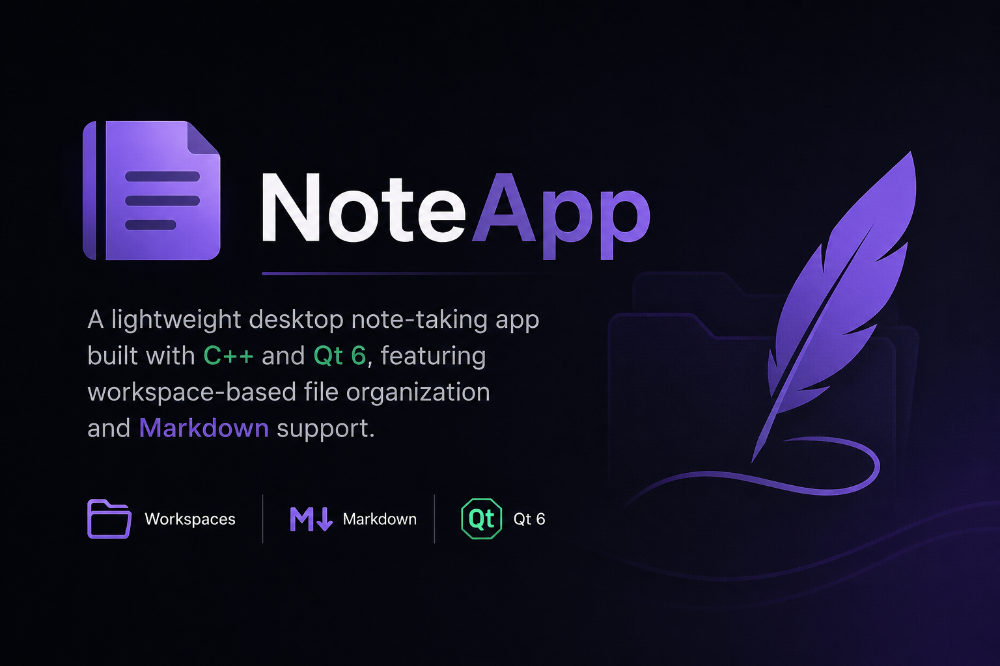

# O-range

  

  
  
  
  

Qt-приложение для локальных текстовых заметок, организованных в рабочие пространства.

Возможности v0.3:
- рабочие пространства с восстановлением последней открытой папки
- ленивое дерево каталогов и заметок `.txt`/`.md`
- создание, переименование и удаление файлов и папок
- безопасное удаление через корзину ОС
- контекстное меню с Explorer и свойствами
- открытие и редактирование заметок во вкладках
- моноширинный UTF-8 редактор с отслеживанием изменений
- сохранение через `Ctrl+S` и `Save As...` через `Ctrl+Shift+S`
- защита от потери текста при закрытии или исчезновении исходного файла

Документация:
- [Техническое задание](docs/TS/tech_spec.md)
- [ТЗ v0.1](docs/TS/ts_v0_1.md)
- [ТЗ и результат v0.2](docs/TS/ts_v0_2.md)
- [Обзор архитектуры](docs/architecture/overview.md)
- [Модули](docs/architecture/modules.md)
- [Git conventions](docs/workflows/git_conventions.md)
