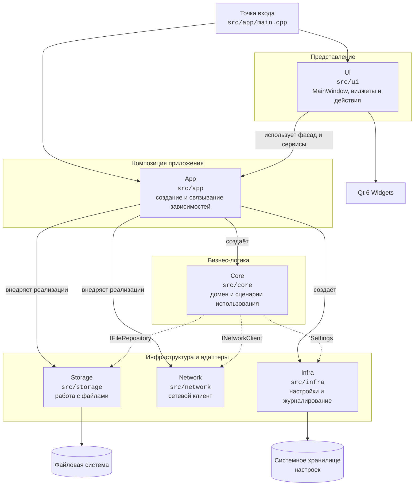

# Модули приложения

## Схема зависимостей

Сплошные стрелки показывают прямое использование или создание объектов, пунктирные — зависимости бизнес-логики, передаваемые через конструктор.

## Назначение модулей

| Модуль | Ответственность | Основные элементы |
|---|---|---|
| `app` | Запуск приложения и сборка графа объектов | `main`, `App`, `AppVersion` |
| `ui` | Окна, виджеты, действия пользователя и отображение данных | `MainWindow`, `PlaceholderWidget`, `ActionIds` |
| `core/domain` | Доменные типы без логики представления | `Workspace`, `NoteId` |
| `core/usecases` | Сценарии использования приложения | `IWorkspaceService`, `WorkspaceService` |
| `storage` | Абстракция и реализация доступа к файлам | `IFileRepository`, `FsFileRepository` |
| `network` | Абстракция сетевого доступа и временная реализация | `INetworkClient`, `StubNetworkClient` |
| `infra` | Общие инфраструктурные службы | `Settings`, `Logger` |

## Правила зависимостей

- `app` является корнем композиции: создаёт конкретные реализации и передаёт их потребителям.
- `ui` получает доступ к возможностям приложения через `app::App` и интерфейсы сервисов.
- `core` содержит бизнес-логику и не создаёт объекты `storage`, `network` или `infra` самостоятельно.
- `storage` и `network` отделяют интерфейсы от конкретных реализаций, чтобы реализации можно было заменять.
- Доменные типы из `core/domain` не должны зависеть от UI и инфраструктурных деталей.
